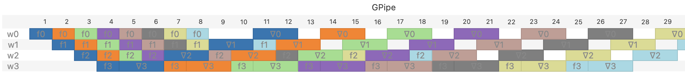

<script type="module">
  import mermaid from 'https://cdn.jsdelivr.net/npm/mermaid@11/dist/mermaid.esm.min.mjs';
</script>
# Introduction

There are several strategies to train large neural networks over multiple GPUs.
The best practice today is to employ a mix  Data
Parallelism, Pipeline Parallelism, and Tensor Parallelism simultaneously.  This
document describes a master schedule that unifies all these schemes under one
code base. From this unified view , we derive a new distributed schedule that
can mix and match the tradeoffs between these schemes, obviating the need to
deploy all three schemes simultaneously.

There are two main reasons to use multiple GPUs when training large models:
First, it speeds up training by making more FLOPS available. Second, it supplies
the memory needed to store the weights, activations, and the optimizer state to
train a large model.  In Distributed Data Parallelism (DDP), each worker is
assigned to a subset of the training batch called a micro-batch. Each worker
computes the gradient on its micro-batch using backpropagation. The main
advantage of this scheme is that all workers operate independently of each
other, so they are almost fully utilized during backpropagation.  One down side
of this method is that each worker must retain the activations of all the layers
of the network, which is infeasible for large models.  Another down side of this
scheme is that the number of workers must exactly match the number of
micro-batches.  Large batch sizes improve compute utilization, but they also
cause each epoch of training to make less progress on the training loss than
with smaller batches (see Section 2.1 of this [folk wisdom
paper](https://arxiv.org/pdf/1206.5533) and Theorem 5.8 of this [more
theoretical paper](https://arxiv.org/pdf/2301.11235)).  In other words, the
training loss drops more slowly per training datum as the number of
micro-batches in a batch grows, and therefore as the number of workers
increases.  Yet another disadvantage of this method is that each worker
must store the weights for all the layers, which is again infeasible for large
models.  Fully Sharded Data Parallelism (FSDP) addresses this latter issue by
having each worker hold the weights for only one stage, and page in the weights
for other states from other workers as needed. Pipeline Parallelism (PP)
addresses some of these problems by assigning to each worker a subset of the
stages. Each worker still processes all micro-batches in the batch, but only for
the stage assigned to the worker.  A micro-batch works its way through the
stages by passing from one worker to the next. An advantage of this method is
that each worker need only store the weights for the stages assigned to it.
Another advantage is that it accommodates more workers than there are
micro-batches, offering a way to add more workers to the task A problem this it
is that it has higher latency than DDP: Some workers remain idle until the first
mini-batch has made it through the final stage, and then some workers become
idle again as the last micro-batch winds its way through the stages.
Surprisingly, the amount of activations each worker stores still scales with the
number of micro-batches because each worker most store the activations of all
the batches that traverse it (though see the table below for a cap on this
number).  To address these issues, Looped Pipeline Parallelism (LPP) operates
several Pipeline Parallel processes in independent groups, and distributes the
micro-batches evenly across these groups. This makes LPP run almost as fast as
DDP when the number of groups is large. Fully Sharded Looped Pipeline
Parallelism (FSLPP) is a variant of LPP where each worker stores the weights of
only one stage, and pages in the weights of the other stages it must process
from other workers as needed.

The table below summarizes the performance tradeoff between these schemes. To
keep the table simple and the subsequent analyses simple, we assume stages
require identical compute and produce idential activations.  The model and the
code don't rely on these simplifications.


| Scheme | Constraints | Latency&nbsp;&nbsp;&nbsp;&nbsp; |  Activation Xmit per Worker | Weight Xmit per Worker | Activation Storage per Worker | Weight Storage per Worker |
| - | - | - | - | - | - | - |
| Distributed Data Parallel (DDP)  | $W=B$        | $S$               |  0     | 0       | $S$         | $S$   |
| Fully Sharded DDP (FSDP)         | $W=B$        | $S$               |  0     | $S-1$   | $S$         | 1     |
| Pipeline Parallel (PP)           | $W=S$        | $B+S-1$           |  $B$  | 0       | $\min(S,B)$         | 1     |
| Looped PP (LPP)                  | $W=GR$       | $S+\frac{B}{G}-1$ |  $B$  | 0       | $\frac{S}{R}\min\left(S,\frac{B}{G}\right)$ | $\frac{S}{R}$ |
| Fully Sharded LPP (FSLPP)        | $W=GR$       | $S+\frac{B}{G}-1$ |  $B$  | $S-1$   | $\frac{S}{R}\min\left(S,\frac{B}{G}\right)$ | 1     |

**Table:** _Latency, network, and memory usage for the schedules unified in this
document. $W$ is the number of workers, $S$ is the depth of the network being
trained, and $B$ is the number of microbatches. Looped models break $W$ into $G$
groups of $R$ workers.  The formulas assume computing a forward and backward step
on any stage takes a unit of time, weights for all stages take a unit of
weight storage and a unit of transmit, and activations for all stages take a
different kind of unit of activation storage and transmit.  To keep the latency
computation simple, we assume that transmission latencies can be hidden by
overlapping them with compute._


Some useful patterns emerge from the table above. In LPP, the workers are split
into $G$ groups of $R$ workers each.  LPP's performance smoothly interpolates
between that of PP and DPP as $R$ and $G$ are varied: When $G=1$ and $R=S$, LPP
is identical to PP. When $G=B$ and $R=1$, LPP is identical to DDP. We take
advantage of this observation below to unify these algorithms under one
implementation.  The activation storage for each worker under LPP can be reduced
by either increasing either $R$ or $G$. An attractive regime is when the number
of workers scales far beyond the number of batches and stages, with $W=\epsilon
SB$ for some fixed $\epsilon \in (0,1)$.  Setting  the number of groups
$G=\epsilon B$ and the number of workers in each group to $R=S$ causes the
latency to be $S+\frac{1}{\epsilon}-1$, the activation storage for each worker
to be $\frac{1}{\epsilon}$, and have each worker store just one set of weights.
Concretely, with $\epsilon=\tfrac{1}{2}$, the latency of LPP becomes $S+1$,
almost as low as that of DDP, yet each node need store at most two sets of
activations and just one set of weights at any time. We show below that this
configuration almost achieves the best possible utilization for the workers
given the activation memory constraints.

On the surface, these forms of parallelism appear so different that they're traditionally
implemented with different code bases. For example, PyTorch implements Data
Parallism under `torch.nn.parallel.DistributedDataParallel`, Fully Sharded Data
Parallism under `torch.distributed.FSDP` avariants of Pipeline Parallelism
under `torch.distributed.pipelining`, and Tensor Parallelism 
under `torch.distributed.tensor.parallel`. Large models training
code bases rely on all these packages simultaneously.  But all these schemes
turn out to be instances of the same master schedule. This master schedule takes
as input two functions: A function that maps a work unit to a compute worker,
and a second function that maps each stage of the pipeline to a worker that
stores the source of truth for that stage's weights.  Together, these two
functions specify the schedule of computation and the implied transfer of weight
and activation data.  Changing these two functions produces the entire spectrium
of distributed trainig algorithms.  With the master scheduler offered in this
document, all these different schedules and their hybrids can be implemented
with just one compute and one weight storage function.  The resulting training
recipe would be easier to debug and maintain, and will make it easier to explore
the larger space of possible schedules.

In summary, this document offers the following contributions:

* A way to implement several distributed training schemes in a unified code
 base. Under this abstract, a parallel training scheme is defined by a compute
 function and a weight storage function.  This in turn simplifies the client code by obviating
the need to import different APIs for each distribution scheme. The client code
can instead supply the the compute and weight storage function that describes a
mix of parallel schemes.

* A variant of Pipeline Parallelism,  called Fully Sharded Looped Pipeline
  Parallelism (FSLPP), whose behavior smoothly interpolates between FSDP,
  and PP, allowing it to enjoy the best all worlds these methods. Along the way, we also
  modify Looped Pipeline Parallelism to interpolate between DDP and PP.

* Guidlelines to set the parameters of LPP. We show that
scaling the number groups  in LPP to be proportional to the number of
micro-batches and setting the number of workers in each group to limit the
amount of activation memory required from each worker causes LPP to nearly attain the optimal
throughput achievable by any distributed training scheme. This implies that
under the assumptions of this doc, not much improvement is possible over the LPP
family of schedules.

## Distributing back-propagation

Our job is to compute, with the help of $W$ workers, the following set of operations:

$$\begin{align*}
x_{s+1}^b &= F_s \; x_s^b \\
z_s^b &= B_s(x_s^b) \; z_{s+1}^b \\
s &\in [0, S), \; b \in [0, B),
\end{align*}$$

Here, $S$ is the number of layers of the neural network (which we refer to as
stages of the pipeline), $B$ is the number of mini-batches, $x_s^b$ is the
output of stage $s$ on mini-batch $b$, and $z_s^b$
is the corresponding backward iterate. $F_s$ and $B_s$ are the forward and
backward operators for stage $s$.  See the appendix for formal definitions of these quantities.

### Formal definitions of distributed schedules

To specify which worker should compute which stage, define a function
$w_\text{compute}(s,b,d): [S]\times [B] \times \{\text{Forward},
\text{Backward}\}\to [W]$. This function maps a stage and mini-batch's compute
to a worker. To specify which worker stores the source of truth for a stage's
parameters, define a function $w_\text{weights}(s): [S] \times [B] \times
\{\text{Forward}, \text{Backward}\}\ \to [W]$.   This pair of functions 
explicitly specifies where the compute and storage happens. It also implicity
specifies what data will be transmitted between workers. It's understood that
whenever $w_\text{compute}(s,b,d)\neq w_\text{weights}(s,b,d)$, worker
$w_\text{compute}(s,b,d)$ will fetch the weights for stage $s$ from worker
$w_\text{weights}(s,b,d)$. Furthermore, worker
$w_\text{compute}(s,b,\text{Forward})$ will fetch the activations from worker
$w_\text{compute}(s-1,b,\text{Forward})$, and worker
$w_\text{compute}(s,b,\text{Backward})$ will fetch the gradients from worker
$w_\text{compute}(s+1,b,\text{Backward})$.  We'll combine these two functions
into a single function $w(s,b,d)$ that returns the tuple $$w(s,b,d) \equiv
(w_\text{weights}(s,b,d), \; w_\text{compute}(s,b,d)).$$

This formulation assumes that the smallest unit of work that can be assigned is
a mini-batch at a particular stage.  But finer-grained units of work are
possible and in common use.  One could,  for example, split each $F_s$ into
pieces that execute on a different worker, as is done in tensor parallelism.  Or
one could split $B_s$ into two pieces, one for the recursive step and one to
compute the gradient of the weights, as is done in [Zero
Bubble](https://github.com/sail-sg/zero-bubble-pipeline-parallelism).  Both of
these cases amounts to adding additional parameters to the function $w(s,b,d)$,
corresponding to additional axes of parallelism. To keep the notation simple,
we'll proceed with mini-batch and stage-wise granularity.  This formulation
accommodates $F_s$ and $B_s$ for the same mini-batch to execute on different
workers, an idea we explored in the companion notebook..


We'll illustrate the various training schedules
with pipeline diagrams. In these diagrams, the columns are time indices, and
each row corresponds to a worker. The cells in the diagram describe the activity
of the worker during the corresponing time.  The color of each cell indicates
the id of the batch being processed. The cell value indicates whether the work
is for the forward or backward pass, and the pipeline stage being processed.
For example, here is the pipeline diagram for Distributed Data Parallelism, when
there are 8 workers, 8 batches, and 4 stages:


In Distributed Data Parallelism, there is a one-to-one correspondence between
workers and batches. Each worker processes every stage of the batch assigned to
it in sequence.
Distributed Data Parallelism (DDP) can be formally defined as:

$$w_\text{DDP}(s, b, d) = (b, b).$$

The mini-batch index dictates where compute happens and where the
parameters are stored, so $w$ is only a function of $b$, and $W=B$.  Because the
two components of $w$ are always equal, the weights are always on the worker
that performs the compute, so weights don't need to be transferred. Further,
because $w_\text{DDP}(s,b,d) = w_\text{DDP}(s-1,b,d)$, no activations need be
transferred either. In return, every worker must store all weights and
activations for every stage, which makes DDP thrash from memory to slower
storage for large models, or recompute the activations during backward pass.
Another shortcoming of DDP is that the degree of parallism must scale with $B$,
which forces us to use large batch sizes. 

[Fully Sharded Data Parallelism](https://arxiv.org/abs/2304.11277) (FSDP)
overcomes some of these difficulties by sharding model parameters and the
optimizer state across workers.  The pipeline diagram for FSDP looks identical to
that of plain DDP. Formally, FSDP is:

$$w_\text{FSDP}(s, b, d) = (s, b).$$

Like DDP, the choice of compute worker only depends on $b$, but unlike DDP, each
compute worker must fetch the weights from worker $s$.  When $s=b$, the weights
for the stage are resident on the worker, so no transfer is needed. Each worker
must still store all the activations for every stage, which again introduces
thrashing.


In Pipeline Parallelism, aka [GPipe](https://arxiv.org/abs/1811.06965), there is
a one-to-one correspondence between workers and stages.
Each worker processes every batch, but only at the stage assigned to the worker:



GPipe is specified by

$$w_\text{GPipe}(s, b, d) = (s, s).$$

In GPipe, each stage $s$ has its own compute worker, so $W=S$. The weights
for stage $s$ are also stored on worker $s$, so no weight need to be
transferred. But unlike DDP, $w_\text{GPipe}(s,b,d) \neq w_\text{GPipe}(s-1,b,d)$,
so activations must be tarnsferred between adjacent stages.  More importantly, because
$s$ determines the worker, no two mini-batches can simultaneously be in the same
stage. This introduces pipeline bubbles that increase the latency of the
pipeline.

An improvement on GPipe is [Looping Pipeline
Parallelism](https://arxiv.org/abs/2104.04473) (LPP).  In LPP, each worker can
process more than one stage of the pipeline.  It does this by organizing the $W$
workers into $G$ groups of $R$ workers, so $W=RG$.  Each worker stores
parameters for $S/R$ stages, so each group is capable of processing all $S$
stages of the pipeline. Here is a pipeline diagram when there are $G=2$ groups:


LPP is specified by

$$\begin{align*}
w_\text{LPP}(s, b, d) &= (h(s,b),\; h(s,b)) \\
h(s, b) &=  \left(Rb \bmod W \right) + \left(s\bmod R\right).
\end{align*}$$

The first term of $h$ can be rewritten as $R\left(b \bmod G\right)$. It maps $b$
to one $0,R,2R,\ldots, W-R$. The second term maps $s$ to the range $[0, R)$,
filling in the gaps generated by the first term.  The hash $h$ isn't the only
viable mapping for LPP. Any other function that distributes $(s,b)$ uniformly
over the workers and maps an increment in $s$ to an increment in the worker id
modulo $R$ would also be adequate.  But $h$ has additional properties that make
it appealing: When $W=S$ and there is just one group, $G=1$, $R=W$, and we get
$h(s,b) = s$, so LPP becomes GPipe.  When $W=B$ and each worker is in its own
group, $G=W$, $R=1$, and we get $h(s,b) = b$, so LPP becomes DDP. This way of
representing LPP therefore lets  us interpolate from DDP to GPipe by just
varying $R$.

In LPP, workers store the weights of all the stages they process because we
forced $w_\text{compute} = w_\text{weight}$.  We can relax this restriction
and make LPP behave more like FSDP.  We call this hybrid idea Fully Sharded
Looped Pipeline Parallelism (FSLPP):

$$w_\text{FSLPP}(s, b, d) = (h(s,b),\; h(s,s)).$$

The hash function $h$ is identical to LPP, but $w_\text{weights}$ 
replaces the batch id with the stage id. Consider the simpler situation when
$G=R$, so that there are $W=R^2=G^2$ workers. First, no worker stores weights
for more than one stage.  Second, the weights are stored evenly across groups.
Indeed, the first group of workers are $0\ldots R-1$, the second group are are
$R\ldots 2R-1$, and so on, and $h(s,s)$ maps $s\in [0,S)$ to $0, R+1, 2R+1, \ldots W-1$.  Each of these lands in a different group, and they are evenly
distributed across the groups.


## One code to schedule them all

The appendix shows how one scheduler can implement the full variety  of
schedules described above by just specifying their corresponding $w(s,b,d)$. 
This subroutine implements the nuances between DDP, FSDP, PP, LPP,
and the hybrid techniques mentioned aboved. It can also accommodates depth first
and a breadth first schedules, and the various latency hiding techniques used in
them. In this implementation, there are two worker threads per worker. The first
thread peeks at the set of $(s,b,d)$ triplets that are ready to execute, and
greedily executes whichever one it can execute as soon as it appears in a global
work queue. The second thread peeks at the work queue and prefetches the weights
and activations for the next job the worker will need to execute.

Backpropagation on a pipeline  requires lower stages to be computed before
higher stages, and the entire forward pass to be computed before the backward
pass on the same batch.  We'll formalize the dependencies between these
operations with a predictate $\text{pred}(s,b,d)$, which returns the set of
triples $(s',b',d')$ that must be computed to compute $(s,b,d)$. When pred
defines a tree structure, we'll also rely on $\text{succ}$, the inverse of
$\text{pred}$. If a node does not have a predecessor (for example because it is
the leaf of a tree) $\text{pred}$ returns $\bot$. If a node does not have a
successor (for example, because it is the root of a tree), $\text{succ}$ returns
$\top$.  For all $s\geq 0$, backprop requires

$$\begin{align*} 
 \text{pred}(s,b,\text{Forward}) &= \{ (s-1,b,\text{Forward}) \} \\
 \text{pred}(S-1,b,\text{Backward}) &= \{ (S-1,b,\text{Forward}) \} \\
 \text{pred}(s,b,\text{Backward}) &= \{ (s+1,b,\text{Backward}) \} \\
\end{align*}$$

The first condition says that stage $s-1$ must be computed before stage $s$. The
second condition says that the backward pass can only run after the final stage
of the forward pass has run. The third conditions says that the backward pass
progresses in the reverse direction of the forward pass.

This formalism simplifies the code, and will be particularly handy when when we
upgrade the model from a pipeline structure to a tree or DAG structure, as is
the case in models with multiple encoder legs.

Some schedules differ in how worker break ties when the preconditions for more
than two jobs $(s,b,d)$ are satisfied. For example, in the 1F1B schedule, a
worker processes the backward pass preferentially over the forward pass. In the
so called "depth first" schedule, a worker processes whichever job has been
pending the longest.  We'll define the function $n(s,b,d)$, which maps each job
to a unique integer, thereby providing a total order on the set of jobs.
defining the order of operations. The higher priorty the job has, the smaller
the number.  The schedules only consult this function only to break ties not 
otherwise resolved by the $\text{pred}$ function.

## Looped Pipeline Parallelism has nearly optimal latency subject to activation storage constraints

LPP has some appealing practical properties:

1. It can accommodate more workers than there are stages or batches. Whereas DDP
requires $W=B$ and GPipre requires $W=S$, LPP can have $W=\epsilon SB$ for any
$\epsilon \in (0,1)$. This offers more memory and the potentiaal for more
parallelism.

2. Its latency, $L\equiv S+\frac{B}{G}-1$, drops as $W$ increases, assuming $G$ increases with $W$.

3. The maximum activation storage for a worker, $M\equiv \frac{S}{R}\min\left(S,\frac{B}{G}\right)$, drops as $W$ increases assuming both $G$ and $R$ increase as $W$ increases.

4. The weight storage per worker, $S/R$, also drops as $W$ increases, assuming $R$ increases with $W$.

It turns out that the scaling behavior of LPP is nearly optimal, meaning any
improvements on this behavior is due to affects not modeled in Table 1 above
(for example, the stages are not identical, or because not all communication
latencies can be hidden). To prove this, we'll need the following definition and
upper bound:

**Definition:** The throughput per worker $\rho$ is the number of jobs the average worker finishes per unit time under a schedule. We denote this by $\rho \equiv \frac{SB}{L W}$, where $L$ is the latency of the schedule.

**Definition:** The peak activation storage, $M$, for a worker is the maximum number of activations the worker must maintain at any time during the schedule.

For example, for DDP,  $\rho = \frac{SB}{SB} = 1$, the highest one could hope
for, and the peak activation storage for a worker is $M=S$ since each worker
must maintain the activations for all stages.

The peak activation imposes an upper bound on the throughput per worker:

**Theorem:** Any schedule whose communications latencies can be hidden on a pipeline with identical stages must satisfy $\rho \leq \frac{M}{S}$.

The proof appears in the appendix. Since with DDP, $M=S$, DDP attains the upper
bound $\rho \leq 1$. But this required $M$ to be large.

Remarkably, LPP offers more freedom in setting $M$, yet its  throughput per
worker also nearly saturates this bound.  For any desired $M$, set the number of
groups to $G=B/2$ and the number of workers in each group to $R=\frac{2S}{M}$.
Assuming $S>2$, the peak memory consumption per worker under this configuration
indeed satisfies $M=\frac{S}{R} \min\left(S,\frac{B}{G}\right)$.  The latency of
LPP in this configuration is $S+1$, so its throughput per worker is $\rho =
\frac{SB}{(S+1) RG} = \frac{M}{S+1}$. This nearly matches the upper bound $\rho
\leq \frac{M}{S}$.

## Latency, network, and memory usage from $w(s,b,d)$

The quantities in Table 1 were computed manually for each strategy. All of these
strategies have a setup phase, where the workers gradually fill up with work, a
steady state phase during which all workers are busy, and a drainage phase where
the pipeline gradually gets lets busy. DDP and FSDP enter the steady state phase
immediately. For GPipe, the setup phase takes $S$ steps, and for LPP, it takes 
$S/G$ steps. Not all schedules need to adhere to this pattern.

But we can compute these metrics mechanically for arbitrary strategies by
inspecting $w(s,b,d)$ and $n(s,b,d)$.  To keep the analysis simple, we'll assume
all transmission latencies can be hidden with prefetching.  The multi-threaded
process described above can be simulated with a recursive set of equations.
We'll use the following variables to model the system:

* $j$: A job $(s,b,d)$. We'll use $w_\text{compute}(j)$ as a short-hand for
* $J$: The set of jobs that have executed so far. We'll define the "frontier" to
  be the set of jobs that have successors that have not yet been executed.
  Formally, we say $j\in J$ is in the frontier if $\text{succ}(j) \notin J$.
  $w_\text{compute}(s,b,d)$. 
* $t(j)$: When the job $j$ will finish, expressed in units of time. Only valid
  for jobs in $J$.
* $t(w)$: The when worker $w$ finishes its latest job in $J$. This is a shorthand for
  $\max_{j\in J : w(j) = w} t(j)$.

The following operation identifies a job $j^*$ on the frontier whose successor can be
executed soonest:

$$\begin{align*}
j^* = \arg\min_{j\in J} &\quad \max\left[ t(w_\text{compute}(\text{succ}(j))),\; t(j) \right] \\
\text{s.t. }& \text{succ}(j) \notin J.
\end{align*}$$

It does this by examining every job $j$ on the frontier.  The
constraints just ensure $j$ is on the frontier.  $t(j)$ is when the job on the
frontier will finish. Its successor cannot start until then. $t(w_\text{compute}(\text{succ}(j)))$ is the first
available slot for its successor's worker, so $\max\left[
t(w_\text{compute}(\text{succ}(j))),\; t(j) \right]$ is when the successor job can first
be executed.  Once the frontier job $j^*$ has been identified, we update

$$\begin{align*}
t(j^*) &= \text{duration}(\text{succ}(j^*)) +  \max\left[ t(w_\text{compute}(\text{succ}(j))) + t(j^*) \right] \\
J &\leftarrow J \cup \{\text{succ}(j^*)\}
\end{align*}$$

This process mimicks almost exactly the greedy schedule followed by the
multi-threaded code snippet in the appendix. The difference is that we have not
modeled the tie breaking logic that uses $n(s,b,d)$. To accommodate this order,
it suffices to add a term $\epsilon \cdot n(s,b,d)$ to the objective of the
$\arg \min$. For sufficiently small $\epsilon>0$, this nudges the minimizer
toward job preferred by $n(s,b,d)$.

After $2\times S\times B$ iterations, $J$ will contain all jobs. The latency of
the pipeline can be read from $t(j)$:

$$\text{latency of the pipeline} = \max_j\; t(j).$$

Some statistics of the schedule can be computed more directly from $w(s,b,d)$,
and don't need the full weight of the simulator. The number of times worker $w$
must fetch input activations from another worker is

$$\text{number of times worker $w$ receives activations over the network} =\newline \sum_{s,b\; :\; w_\text{compute}(s,b) = w} 1\left[w_\text{compute}(s-1,b) \neq w\right].$$

This is the number of times the worker has to process a work item $(s,b)$ whose
predecessor was computed by another worker.

The number of times worker $w$ must fetch weights from another worker is

$$\text{number of times worker $w$ receives weights over the network} =\newline \sum_{s,b\; :\; w_\text{compute}(s,b) = w} 1\left[w_\text{weights}(s,b) \neq w\right].$$

This is the number of times the host has to process work for which it doesn't
host the weights.

The amount of activation storage required by a particular worker depends on both
$w(s,b,d)$ and $n(s,b,d)$. We don't have a tidy formula to report
this quantity, but we do have an upper bound:

$$\text{peak activation storage for worker $w$} \leq \sum_{s,b} 1\left[w_\text{compute}(s,b) = w\right].$$

This is just the total number of items the worker processes.


# Appendices

## Appendix: Proof of the throughput lower bound

The proof relies on the concept of memory-time for a variable. This is the
number of time steps during which a variable must stay live during a
computation.  The memory-time of a computation is the sum of memory-times of all
the variables it computes.  A computer with $M$ amount of memory must run for at
least $m/M$ time steps to compute a function that has memory-time $m$.  If the
latency of the algorithm is too small, it cannot accommodate the memory-time
required to process all the jobs.

Backpropagation on a pipeline requires the activations $x_s^b$ to stay live
until the backward pass has executed. So $x_s^b$ must remain live for at least
$2(S-s)+1$ time steps. To illustrate, here is the compute graph for the
backpropagation equations for a four stage pipeline:

<pre class="mermaid">
flowchart-elk LR

    f0
    b0[∇0]
    f1
    b1[∇1]
    f2
    b2[∇2]
    f3
    b3[∇3] 

    f0 --> f1 --> f2 --> f3 
    b3 --> b2 --> b1 --> b0
    f0 --> b0
    f1 --> b1
    f2 --> b2
    f3 --> b3
</pre>

Each batch therefore requires $\sum_{s=0}^{S-1}
2(S-s)-1 = S^2$ memory-time, so processing $B$ batches requires at least
$BS^2$ memory-time.  A schedule with latency $L$ with $W$ workers can provide
at most $LWM$ memory-time. We must therefore have $LWM \geq BS^2$. Plugging in
the definition for $\rho$ gives $\rho \geq M/S$. $\square$


## Appendix: Training a pipeline with back-propagation

To train a neural network, we compute the gradient of a loss function of the
output of the neural network with respect to the parameters of each stage of the
neural network's pipeline.  We'd like compute the gradients of output of an  $S$
stage pipeline with respect to the weights of each of the stages.  Each stage
$s$ is a function $f_s$ parameterized by weights $w_s$. Each stage maps its
input $x_s$ to an output $x_{s+1}$:

$$x_{s+1} = f_s(x_s, w_s).$$

The input of the pipeline is $x_0$, and $x_S$ is the resulting scalar loss
(meaning the final stage computes the loss). To compute the gradient of
$x_{S-1}$ with respect to each $w_0\ldots w_{S-1}$, we execute  a backward pass
where each stage $s$ computes, recursively, the gradient of the loss with
respect to its activations:

$$\frac{\partial x_S}{\partial x_s} = \frac{\partial x_S}{\partial x_{s+1}} \frac{\partial x_{s+1}}{\partial x_{s}},$$

From this, each stage computes the gradient of the loss with respect to the stage's parameters:

$$\frac{\partial x_S}{\partial w_s} = \frac{\partial x_S}{\partial x_{s+1}} \frac{\partial x_{s+1}}{\partial w_{s}}.$$

These operations can be written in a compact operator form:
$$\begin{align*}
x_{s+1} &= F_s \; x_s \\
z_s &= B_s(x_s) \; z_{s+1}
\end{align*}$$

The forward operator $F_s$ applies the function $f_s(\cdot, w_s)$.  For the backward pass,
defined $z_s \equiv (\frac{\partial x_T}{\partial x_s}, \frac{\partial x_T}{\partial w_s})$ 
to capture the state of the backward iteration, and an
operator $B_s(x_s)$ parametrized by the forward activations $x_s$ that
right-multiplies $z_{s+1}$ by the matrix
$\begin{bmatrix}
\frac{\partial }{\partial x_s}f_s(x_s,w_s) & \frac{\partial }{\partial w_s}f_s(x_s, w_s) \\
0 & 0 \\
\end{bmatrix}$.

We are to apply the above pipeline on $B$ mini-batches of data at once without
changing the parameters of the pipeline in the interim. We'll use a superscript
on the inputs, activations, and results generated during the backward pass to
denote each mini-batch, with $x_s^b$ denoting the input of stage $s$ from the
$b$th mini-batch.

## Appendix: One code to schedule them all

This section sketches out pseudocode for the generic task scheduler. The
pseudocode is written in a math-inspired version of Python. Like in Python,
ranges are inclusive of their start and exclusive of their end (so `0..W`
includes 0 but not `W`). The `match` operator is inspired by Haskell and Rust's
match statement.  The set syntax follows established mathematical notation.

Before the round of work starts, we globally initialize a list of available
work:

```python
# A unit of work is a tuple of a batch id and an operator F[s] or B[s].
Direction = 'forward' | 'backward'
Stage = 0..S
Batch = 0..B
Work = (Stage, Batch, Direction)
Worker = 0..W

# Initially, the first stage of all batches is ready to execute.
ready : Set[Work] = {(-1, b, 'forward') : b ∈ Batch}

# Nothing is currently executing.
working_on : Set[Work] = {}
```

Then each worker goes in a loop picking off available work that it can
process:

```python
def available_work(worker: Worker, ready: Set[Work]) → (Work, Work):
    # Find jobs that are ready to be executed by the worker. This blocks
    # until a job is available.
    candidates =  {(job, new_job) ∈ ready x ready :
                   w_compute(new_job) = worker, new_job = pred(job)}

    # Among the candidates, return the pair with the highest priority.
    return find_smallest(candidates, key=lambda (job, new_job): n(new_job))

def fetch_work(w: Worker, ready: Set[Work]) → (Work, Work):
    atomically:
        finished_work, work_to_do = available_work(w, ready)
        remove finished_work from ready
        return (finished_work, work_to_do) 

def worker_compute_thread(w: Worker):
    while True:
        finished_work, work_to_do = fetch_work(w, ready)

        match work_to_do:
            stage, batch, 'forward':
                # Initiate prefetch
                insert work_to_do into working_on

                # Start computing
                new_activations = F[stage](
                    await_weights(stage),
                    await_activations(stage - 1, batch)
                )
                store_activations(stage, batach, new_activations)
                insert work_to_do into ready

            stage, batch, 'backward':
                # Initiate prefetch
                insert work_to_do into working_on

                # Start computing
                new_grad = B[stage](
                   (stage < S) and await_gradients(stage+1, batch),
                   await_weights(stage),
                   await_activations(stage, batch)
                )
                store_gradient(stage, b, new_grad)


def worker_prefetch_thread(w: Worker):
    # Optional thread that hides the fetching latency in the compute thread
    # by prefetching weights and activations.
    while True:
        finished_work, work_to_do = fetch_work(w, working_on)
        match work_to_do:
            stage, batch, 'forward':
                prefetch_weights(stage)
                prefetch_activations(stage - 1, batch)
            stage, batch, 'backward':
                (stage < S) and prefetch_gradients(stage + 1)
                prefetch_weights(stage)
                prefetch_activations(stage, batch)
```

The code above depends on $w_\text{compute}$ only through the `available_work`
function.  It depends on $w_\text{weights}$ through the `await_gradients`,
`await_activations` and their prefetch varaiants.  